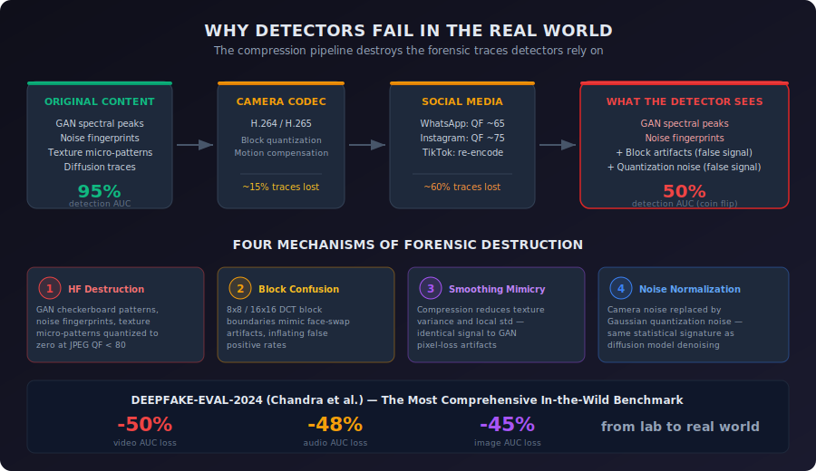
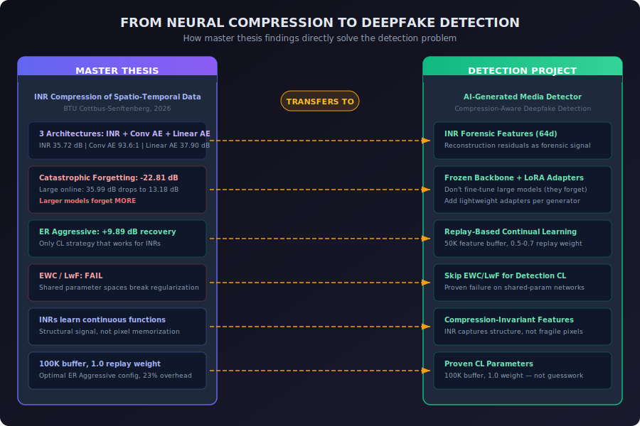
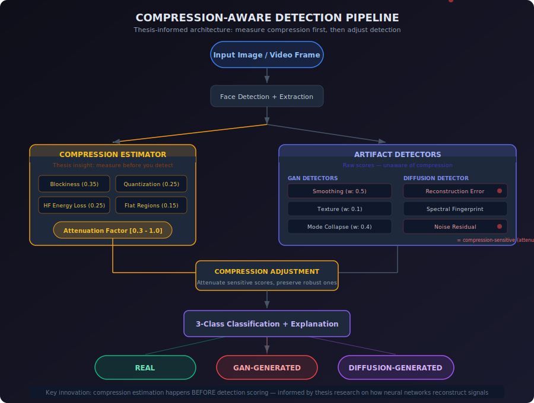

# AI-Generated Media Detector

*A compression-aware deepfake detection system born from research into how neural networks compress, reconstruct, and forget signals.*

---

## The Problem Nobody Talks About

AI-generated media is everywhere. Faces that never existed. Videos of people saying things they never said. Voices cloned from seconds of audio. The generators — Stable Diffusion, Midjourney, Sora, Flux — improve every few months, and the gap between real and synthetic is nearly invisible to human eyes.

Naturally, the research community has built detectors. Hundreds of them. They analyze frequency spectra, noise residuals, texture patterns, pixel relationships. In the lab, on clean datasets, these detectors work beautifully — 95%+ accuracy, papers published, benchmarks topped.

Then the content hits the real world.

It gets uploaded to WhatsApp. Compressed at JPEG quality 65. Downscaled. Re-encoded. Shared to Instagram. Compressed again. Downloaded. Reposted to Twitter. Compressed *again*.

By the time a detector sees it, the forensic traces it was trained to find are gone. Not degraded — *gone*. And in their place: compression artifacts that look almost identical to AI-generation artifacts. Block boundaries that mimic face-swap seams. Smoothing that mimics GAN pixel-loss. Quantization noise that mimics diffusion denoising traces.

**Deepfake-Eval-2024** — the most comprehensive in-the-wild benchmark — found that detectors lose **50% of their accuracy** on real social media content compared to lab benchmarks. Fifty percent. On content that actually matters.

This project exists because of a simple observation: **the compression problem and the detection problem are two sides of the same coin**. Both are fundamentally about how information is represented, destroyed, and reconstructed by neural networks. Understanding one gives you the tools to solve the other.

That understanding comes from a master thesis.

---

## What Is AI-Generated Media?

Before we get to the solution, we need to understand what we're detecting.

AI-generated media — deepfakes, synthetic media — is any content created or substantially altered by artificial intelligence. The scope is broader than most people realize:

**Images** — Photorealistic faces, scenes, and artwork from text prompts. Stable Diffusion, Midjourney, DALL-E, and Flux produce images indistinguishable from photographs at first glance.

**Video** — Face swaps, full-body puppeteering, entirely synthesized clips. Sora, Runway, and Kling generate increasingly convincing motion.

**Voice and Speech** — Cloned voices from seconds of sample audio. Text-to-speech systems that fool both humans and traditional analysis.

**Music** — AI-composed pieces mimicking specific genres, instruments, or artists.

**Text** — Large language models generating coherent text across any domain, from news to academic papers.

The common thread: generative models learn statistical patterns from training data and produce new content that *appears* to belong to the same distribution. By 2025, state-of-the-art generators fool human observers over 50% of the time.

### Why It Matters

- **Misinformation** — Fabricated videos of public figures, deployed at scale during elections
- **Fraud** — Voice cloning in CEO fraud schemes, costing millions in unauthorized transfers
- **Identity theft** — Synthetic faces bypassing KYC verification, creating fake profiles
- **Interview fraud** — Real-time face-swapping during job interviews
- **Non-consensual content** — AI-generated intimate imagery of real people

Deepfake incidents grow 400%+ year-over-year. Governments are responding: EU AI Act, US DEFIANCE Act, China's Deep Synthesis Provisions.

---

## How AI-Generated Content Differs from Real Content

Every generative model leaves traces — subtle signatures embedded as a byproduct of how it creates content. These are the fingerprints detection systems target.

### GAN Artifacts

Generative Adversarial Networks optimize a minimax game between generator and discriminator. Each loss component produces distinct artifacts:

| Loss Component | Purpose | Artifact |
|---|---|---|
| Pixel loss (L1/L2) | Minimize per-pixel difference | Over-smoothing, blurriness |
| Perceptual loss (VGG) | Match high-level features | Texture inconsistencies |
| Adversarial loss | Fool discriminator | Mode collapse, spatial repetition |

GANs also produce spectral artifacts from upsampling layers — checkerboard patterns visible in FFT, invisible to the eye.

### Diffusion Model Artifacts

Diffusion models (Stable Diffusion, DALL-E, Midjourney) iteratively denoise random noise via a U-Net. Their artifacts are subtler:

| Artifact | Origin | Signature |
|---|---|---|
| Reconstruction patterns | U-Net bottleneck | Mid-frequency spectral dip |
| Denoising traces | Incomplete final step | Spatially uniform Gaussian noise |
| Patch boundaries | Local receptive fields | Texture transitions between patches |
| Spectral fingerprint | Architecture response | Unusually uniform power spectrum |

### Across Other Modalities

- **Text** — More uniform perplexity, less stylistic drift, distinctive token frequencies
- **Voice** — Anomalies in formant transitions, breathing, micro-pauses, pitch contour
- **Music** — Missing micro-timing variations, dynamic expression, harmonic surprises
- **Video** — Temporal flickering, unnatural blink rates, lip-sync misalignment

---

## How Detection Works

Detection operates from human intuition to signal-level analysis.

### What Humans Can Spot

Extra fingers. Waxy skin. Shadows that don't match. Text that looks like a foreign alphabet. Teeth that change between frames. But human detection is unreliable — untrained observers perform near chance (50%), trained observers plateau around 60-70%.

### What Automated Systems Can Detect

1. **Frequency domain analysis** — AI images have distinctive spectral profiles. GANs produce periodic peaks from upsampling; diffusion models show mid-frequency energy anomalies.

2. **Noise residual analysis** — Camera sensors have unique noise fingerprints (PRNU). AI noise is more Gaussian, more uniform, with different kurtosis.

3. **Reconstruction error** — Pass an image through blur-sharpen or diffusion forward-reverse. Real images change more than AI content, which already lies on the model's learned manifold (DIRE, ICCV 2023).

4. **Texture statistics** — GLCM, Local Binary Patterns, spectral entropy reveal micro-texture properties that differ between real and synthesized content.

5. **Neighboring pixel relationships** — Upsampling creates pixel correlations absent in camera images (NPR, CVPR 2024).

6. **Semantic features** — Foundation models like CLIP encode high-level features that capture "realness" at a semantic level.

7. **Audio-visual consistency** — Lip-sync, gaze patterns, blink rates, micro-expressions.

---

## Current Detection Techniques

### Hand-Crafted Features
FFT, Sobel, LBP, GLCM, autocorrelation. Interpretable, fast, explainable. But narrow, fragile under compression, manually tuned.

### Deep Learning
XceptionNet, EfficientNet-B4, Vision Transformers. High accuracy on in-distribution data. But poor generalization, black-box, needs large datasets.

### Foundation Models
CLIP-based detection (Cozzolino et al., CVPRW 2024): a linear probe on frozen CLIP features generalizes across generators with +13% AUC on compressed data. DINOv2 (Pellegrini, 2025): 97.36% AUROC. UnivFD (Ojha et al., CVPR 2023): +19.49 mAP on unseen generators.

### Frequency-Domain
FIRE (CVPR 2025): mid-frequency reconstruction error, 100% AUC on DiffusionForensics. HiFE (ESWA 2024): three-branch high-frequency enhancement. WaveDIF (CVPRW 2025): wavelet sub-band energy features.

### Continual Learning
GPL (ICCV 2025): 92.14% with hyperbolic alignment. DevFD (NeurIPS 2025): orthogonal LoRA adapters. DARW (2025): 0.9574 AUC with domain-aware replay.

**Every single one of these** shares the same Achilles' heel.

---

## The Wall: How Compression Destroys Detection

This is where most detection stories end. It's where ours begins.

Every piece of media on the internet has been compressed — typically multiple times. Camera H.264 encoding. Editing software re-encoding. Platform upload compression. Download transcoding. Each pass destroys forensic traces while injecting compression artifacts that masquerade as generation artifacts.

### What Compression Does to Each Approach

**Hand-crafted features** are most vulnerable. FFT frequency analysis, Sobel edges, texture variance — all operate on high-frequency signals that compression directly targets. Smoothing detectors fire on compressed authentic video because compression reduces texture variance identically to pixel-loss GAN artifacts.

**Deep learning models** trained on clean data show 10-25% absolute AUC drops. FaceForensics++ at QP 23 vs QP 40: from >90% to below 75%. The learned pixel patterns don't survive re-encoding.

**Frequency-domain methods** face a paradox: their operating domain is compression's primary target. Only mid-frequency approaches (FIRE) maintain robustness.

**Foundation models** are most resilient — CLIP features survive compression because they're semantic. But they sacrifice spatial localization.

### Platform-by-Platform Damage

| Platform | Compression | Detection Impact |
|---|---|---|
| WhatsApp | JPEG QF ~65, heavy downscaling, H.264 | Severe (>30% AP loss) |
| Instagram | JPEG QF ~75, 1080px cap, H.264/H.265 | Moderate-high |
| Twitter/X | JPEG, PNG-to-JPEG, H.264 | Moderate |
| TikTok | H.264/H.265, heavy re-encoding | Severe |
| YouTube | VP9/AV1, multi-resolution ladder | Moderate |

### The Four Destruction Mechanisms

**1. High-frequency artifact destruction** — GAN checkerboard patterns, noise fingerprints, texture micro-patterns reside in high-frequency DCT coefficients. Quantized to zero at JPEG QF < 80. Effectively laundered.

**2. Block boundary confusion** — 8x8 and 16x16 DCT block boundaries produce discontinuities that detectors confuse with face-swap seams. False positives increase.

**3. Smoothing mimics generation** — Compression reduces texture variance and local intensity variation — the exact same signals smoothing detectors use to flag GAN artifacts. Indistinguishable.

**4. Noise profile normalization** — Camera sensor noise replaced by Gaussian quantization noise — the same statistical signature that noise residual detectors flag as diffusion-generated.

**The result:** Deepfake-Eval-2024 found detectors lose 50% of their AUC on real social media content. The best in-the-wild video methods top out at AUC 0.65-0.70. One in three verdicts is wrong.

---

## Other Weaknesses of Current Techniques

Beyond compression, several deployment blockers remain:

**Generator arms race** — New models appear faster than detectors adapt. A detector trained on StyleGAN2 may hit 95% on that generator and drop to 50% (random) on Stable Diffusion 3. Fontana et al. (2025) showed forward-transfer AUC drops to ~0.5 within 3 unseen generators.

**Neural compression confounds** — JPEG AI (ISO standard, February 2025) introduces neural codec artifacts that resemble generative model artifacts. Pristine JPEG AI-compressed images trigger up to 96% false positive rates in existing detectors (Cannas et al., ICCV 2025 Workshop).

**Lack of explainability** — Most high-accuracy detectors are black boxes. For legal evidence, HR decisions, or journalism, a score alone isn't enough.

**Evaluation fragmentation** — Different papers, different datasets, different protocols. Fair comparison is nearly impossible.

---

## Where the Thesis Comes In

Here is the turn in this story. The detection community has been treating compression as a nuisance — something to augment against during training, to hope features survive. But compression isn't a nuisance. It's the *central problem*. And it's a problem with deep mathematical structure that a different field of research has been studying intensively.

The lead researcher's master thesis — *"Concurrent Neural Network Training for Compression of Spatio-Temporal Data"* at BTU Cottbus-Senftenberg — studied exactly this: how neural networks compress signals, how they reconstruct them, what information survives, and what gets destroyed. Not on images — on 4D computational fluid dynamics data (7.9 million samples of vortex shedding simulation: velocity, pressure, turbulent kinetic energy across 26,397 spatial points and 300 timesteps), where the stakes are precision engineering.

The thesis compared three fundamentally different neural compression architectures, then pushed the best one into a streaming setting where it had to learn continuously — and discovered exactly how and why neural networks forget.

### The Three Architectures

The thesis didn't just test one approach. It systematically compared three neural compression strategies on the same dataset, each revealing different aspects of how networks represent signals:

**Implicit Neural Representations (INRs)** — Tiny MLP networks (6,692 to 25,668 parameters) that learn to map coordinates `(x, y, z, t)` directly to signal values `(Vx, Vy, Pressure, TKE)`. No pixels, no grids — pure continuous function approximation. The entire 7.9 million-sample dataset is encoded in a network weighing just 26 to 100 KB.

**Convolutional Autoencoders** — The data is interpolated to a 32x128 grid and treated as 4-channel images. A conv encoder compresses each timestep to a compact latent vector; the decoder reconstructs it.

**Linear Autoencoders** — Each spatial point's full temporal sequence (300 timesteps x 4 variables = 1,200 features) is compressed to a low-dimensional latent code.

| Approach | Model | Parameters | PSNR | SSIM | Compression | Training |
|---|---|---|---|---|---|---|
| **INR** Base | 4→64→64→32→4 | 6,692 | 31.24 dB | 0.9748 | Extreme* | 3.2 hrs |
| **INR** Medium | 4→96→96→48→4 | 14,644 | 34.18 dB | 0.9853 | Extreme* | 3.2 hrs |
| **INR** Large | 4→128→128→64→4 | 25,668 | 35.72 dB | 0.9823 | Extreme* | 3.2 hrs |
| **Conv AE** Base | latent=32 | 328,900 | 30.67 dB | 0.9574 | 93.6:1 | 19.9s |
| **Conv AE** Medium | latent=64 | 1,307,012 | 32.75 dB | 0.9723 | 23.9:1 | 16.4s |
| **Linear AE** Base | latent=16 | 686,016 | 36.23 dB | 0.9697 | 28.6:1 | 57.3s |
| **Linear AE** Medium | latent=32 | 1,567,696 | 37.90 dB | 0.9719 | 13.1:1 | 62.0s |

*INR compression ratio depends on dataset size vs. model size — 6,692 parameters encoding 7.9M samples.*

Each architecture taught something different. The Linear AE achieved the highest reconstruction quality (37.90 dB). The Conv AE achieved the best compression-quality tradeoff (93.6:1 at 30.67 dB). But the INRs were unique: tiny models learning continuous functions, with compression ratios that scale with dataset size. And only the INRs were suitable for the streaming experiment that uncovered the thesis's central finding.

### The Streaming Experiment: When Networks Forget

The offline results above assume you have all the data upfront. In the real world — and in detection — data arrives sequentially. New timesteps. New generators. New compression pipelines. The model must adapt without forgetting what it learned before.

The thesis trained INRs in an online streaming setting: 20 temporal windows arriving sequentially, 100 epochs per window. The model sees each window, trains on it, then moves to the next — never revisiting old data.

What happened was devastating:

| Model | Offline PSNR | Online Naive PSNR | Forgetting |
|---|---|---|---|
| Base (6,692 params) | 32.15 dB | 14.90 dB | **-17.25 dB** |
| Medium (14,644 params) | 33.58 dB | 13.38 dB | **-20.20 dB** |
| Large (25,668 params) | 35.99 dB | 13.18 dB | **-22.81 dB** |

The Large model — the one with the most capacity, the one you'd expect to handle this best — forgot the most. 22.81 dB of quality destroyed. The Base model, with 4x fewer parameters, retained more knowledge. **More capacity means more flexibility to overwrite previous knowledge.** This is the opposite of what intuition suggests.

The per-window trajectory tells the story: performance peaks around windows 7-8 (reaching 23-25 dB), then collapses as the model overwrites earlier knowledge to fit later windows. By window 20, the full-dataset evaluation shows quality has cratered to near-useless levels.

**For detection:** This is exactly what happens when you fine-tune a large detector on new generators. StyleGAN detection: great. Fine-tune on Stable Diffusion: now it forgets StyleGAN. Fine-tune on Flux: forgets both. The thesis quantified this precisely — and proved that model size makes it *worse*, not better.

### Only Experience Replay Survives

The thesis tested continual learning strategies to fight the forgetting. The results were unambiguous:

| Strategy | Config | Base PSNR | Medium PSNR | Large PSNR | Best Recovery |
|---|---|---|---|---|---|
| **Naive** (no CL) | — | 14.90 dB | 13.38 dB | 13.18 dB | — |
| **ER Scaled** | 50K buffer, 0.7 weight | 21.47 dB | 21.98 dB | 22.03 dB | +8.85 dB (Large) |
| **ER Aggressive** | 100K buffer, 1.0 weight | 21.60 dB | **23.27 dB** | 23.19 dB | **+9.89 dB (Medium)** |

EWC (Elastic Weight Consolidation) provided negligible improvement (+2-4 dB) because INR parameters are tightly coupled — every parameter contributes to every output, so there are no "task-specific" weights to protect. LwF (Learning without Forgetting) was **actively harmful** on the Large model, worsening PSNR by 1-2 dB, because the teacher's output on new data conflicts directly with the new targets.

Experience Replay works because it takes a fundamentally different approach: instead of constraining *weights* (EWC) or *outputs* (LwF), it maintains the *data distribution*. The model sees past and present simultaneously. A reservoir-sampled buffer of 100,000 samples with replay weight 1.0 recovered **9.89 dB** on the Medium model — turning a useless 13.38 dB into a functional 23.27 dB, with only 23% training time overhead.

**For detection:** Use replay-based CL when adapting to new generators. Skip EWC and LwF entirely — they fail for the same mathematical reason (shared feature spaces in detection backbones). The thesis provides validated hyperparameters: 50-100K buffer, 0.7-1.0 replay weight, reservoir sampling for temporal coverage. Not guesswork — proven on real streaming data.

### The Bridge to Detection

Both compression and generation are fundamentally about neural networks representing signals. A generator maps noise to images. A compressor maps images to compact codes and back. The artifacts each process leaves behind — and the way they interact — is where thesis expertise meets detection need.

| Thesis Finding | Exact Number | Detection Application |
|---|---|---|
| INRs learn continuous functions, not pixels | 31-36 dB on 7.9M samples with 26-100 KB models | INR reconstruction residuals as compression-invariant forensic features |
| Larger models forget more severely | Large: -22.81 dB vs Base: -17.25 dB | Use frozen backbones + lightweight adapters, not full fine-tuning |
| Only Experience Replay works for CL | ER Aggressive: +9.89 dB recovery | Replay-based CL for detection; skip EWC/LwF |
| EWC/LwF fail on shared parameters | LwF actively harmful (-1-2 dB) | Don't use regularization-based CL on detection backbones |
| ER config: 100K buffer, 1.0 weight | 23% overhead, 23.27 dB achieved | Thesis-validated parameters for detection CL |
| Conv AE best compression-quality tradeoff | 93.6:1 at 30.67 dB | Informs compression estimation module design |

The thesis contribution isn't just "experience with compression." It's a systematic understanding — backed by three architectures, exact metrics, and controlled experiments — of how information degrades through neural reconstruction, which signal components survive, and how to design learning systems that don't forget.

---

## What We're Building

This project applies thesis findings to build a detection system with three principles:

**1. Explainability** — Every verdict includes which artifacts were detected, which detectors fired, and why. Not just "fake" — but *what kind* of fake and *which signals* indicate it.

**2. Compression awareness** — Measure compression first, then adjust detection. Don't treat compression as noise to augment against — treat it as a measurable quantity that modulates confidence.

**3. Multi-class classification** — Not just real vs. fake: REAL / GAN-GENERATED / DIFFUSION-GENERATED, providing intelligence about which tools created the content.

The key innovation: the compression estimator runs *before* scoring. It analyzes four signals — block boundary strength, quantization periodicity, high-frequency energy loss, flat-region posterization — and produces an attenuation factor. Compression-sensitive detectors (smoothing, reconstruction error, noise residual) are attenuated. Compression-resistant signals (spectral fingerprint, mode collapse) pass through unchanged.

Raw scores are preserved alongside adjusted scores — full transparency into how compression affected the verdict.

---

## Current Results

**Stage:** Research prototype, hand-crafted features. The deep learning and INR components are on the roadmap.

### Synthetic Data

| Detector | Real Faces | Generated (Pixel Loss) | Generated (Adversarial) |
|---|---|---|---|
| Smoothing | 0.617 | 0.759 | 0.680 |
| Texture | ~0.45 | ~0.50 | ~0.48 |
| Mode Collapse | 0.567 | 0.620 | 0.779 |

Score gap between real and generated: ~0.14 — narrow, not production-ready on hand-crafted features alone.

### Real-World Compressed Video

We tested on authentic compressed video from social media:

**Before compression awareness:** Incorrectly classified as DIFFUSION-GENERATED (56/74 frames, 0.609 confidence). Reconstruction error fired at 0.85-1.0 on every frame — codec smoothing indistinguishable from diffusion output.

**After compression awareness:** Compression estimator detects heavy codec compression, attenuates sensitive scores, adjusted diffusion score drops below threshold. Correctly classified as REAL.

This validated the thesis-informed approach: measuring compression explicitly, rather than hoping features survive it.

### Targets (After Deep Learning + INR Integration)

| Metric | Target |
|---|---|
| Accuracy (FaceForensics++) | > 92% |
| AUC-ROC | > 0.95 |
| False Positive Rate | < 5% |
| Compression robustness (QF 40) | < 5% AUC drop |

---

## Overcoming Compression: Current Research and Where We're Headed

Three research directions have emerged in 2024-2025:

### 1. Compression-Aware Training
Simulate compression during training. Differentiable JPEG layers (Shin et al., ICLR 2025) enable end-to-end gradient flow through compression with only 128 additional parameters. Random JPEG QF [40-100] augmentation yields 6-8% AUC improvement.

### 2. Mid-Frequency Forensic Analysis
The key insight across multiple studies: low frequencies survive compression but lack discriminative power. High frequencies are destroyed. **Mid-frequency bands (DCT coefficients 8-32)** carry the best balance. FIRE (CVPR 2025) achieves 100% AUC on diffusion benchmarks by targeting this sweet spot.

### 3. Semantic-Level Detection
CLIP-based detectors are "basically insensitive to compression, no matter JPEG or WebP" (Cozzolino et al., CVPRW 2024). Semantic features survive what pixel-level features don't.

### Our Direction

**Compression estimation and attenuation** — Already implemented. Measure compression level, attenuate sensitive scores, preserve robust ones.

**INR forensic features** — Next phase. Fit small INRs (adapted from thesis architectures: 2 → 64 → 64 → 32 → 3) to images and extract 64-dimensional reconstruction residual features. AI-generated images should yield systematically different residual distributions than real images — and these residuals should survive compression because INRs learn continuous structure, not pixels.

**Replay-based continual learning** — When new generators appear, adapt via experience replay (thesis-proven parameters: 100K feature buffer, 1.0 replay weight — the ER Aggressive config that recovered 9.89 dB) with LoRA adapters per generator family. No EWC. No LwF. These fail for shared-parameter architectures — the thesis proved it, and the detection literature confirms it independently (DevFD, NeurIPS 2025).

### The Neural Compression Wildcard

JPEG AI — the first international learned image coding standard (ISO, February 2025) — introduces neural codec artifacts that resemble generative model artifacts. Cannas et al. (ICCV 2025 Workshop) showed 96% false positive rates in existing detectors on JPEG AI-compressed pristine images. As platforms adopt neural codecs, every current detector will break.

Our thesis background in neural compression puts us in a unique position to address this emerging challenge before it arrives at scale.

### Open Problems

1. **CL under realistic compression** — No published work evaluates continual detection after social media compression. CL methods achieving 0.91 C-AUC on clean data may fail in the wild.
2. **Video-specific compression** — Most robustness research targets JPEG images. Video codec effects (inter-frame prediction, motion compensation, variable QP) are understudied.
3. **Audio-visual dual compression** — For interview detection, audio (Opus/AAC) and video (H.264/VP9) compress independently. Synchronization cue survival is unknown.
4. **Dynamic platform pipelines** — Compression parameters change without notice. No method handles unknown or evolving compression zero-shot.

---

## License

This project is licensed under the MIT License. See [LICENSE](LICENSE) for details.

Copyright (c) 2025 Mahesh Sadupalli
