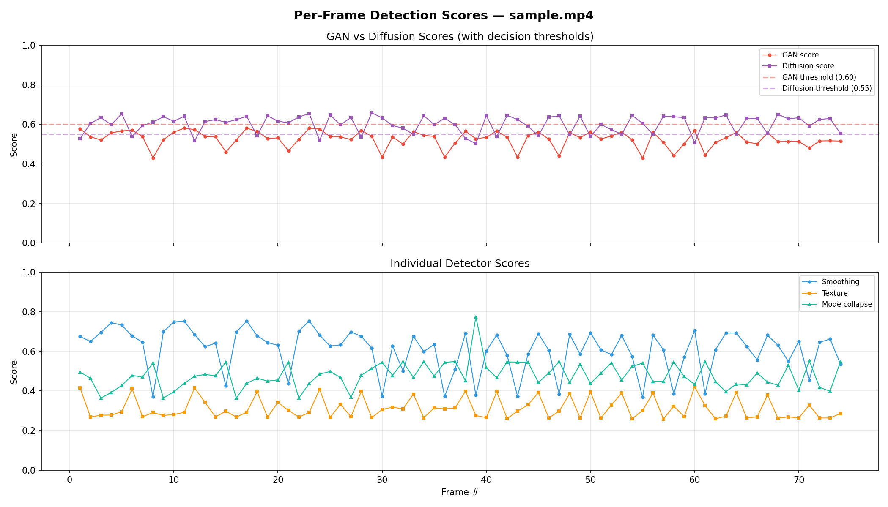
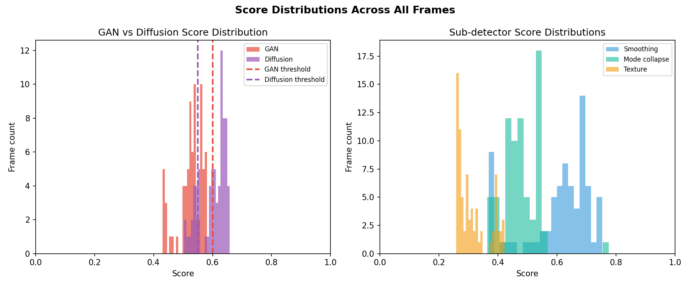
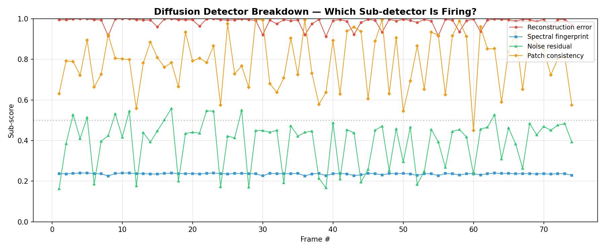
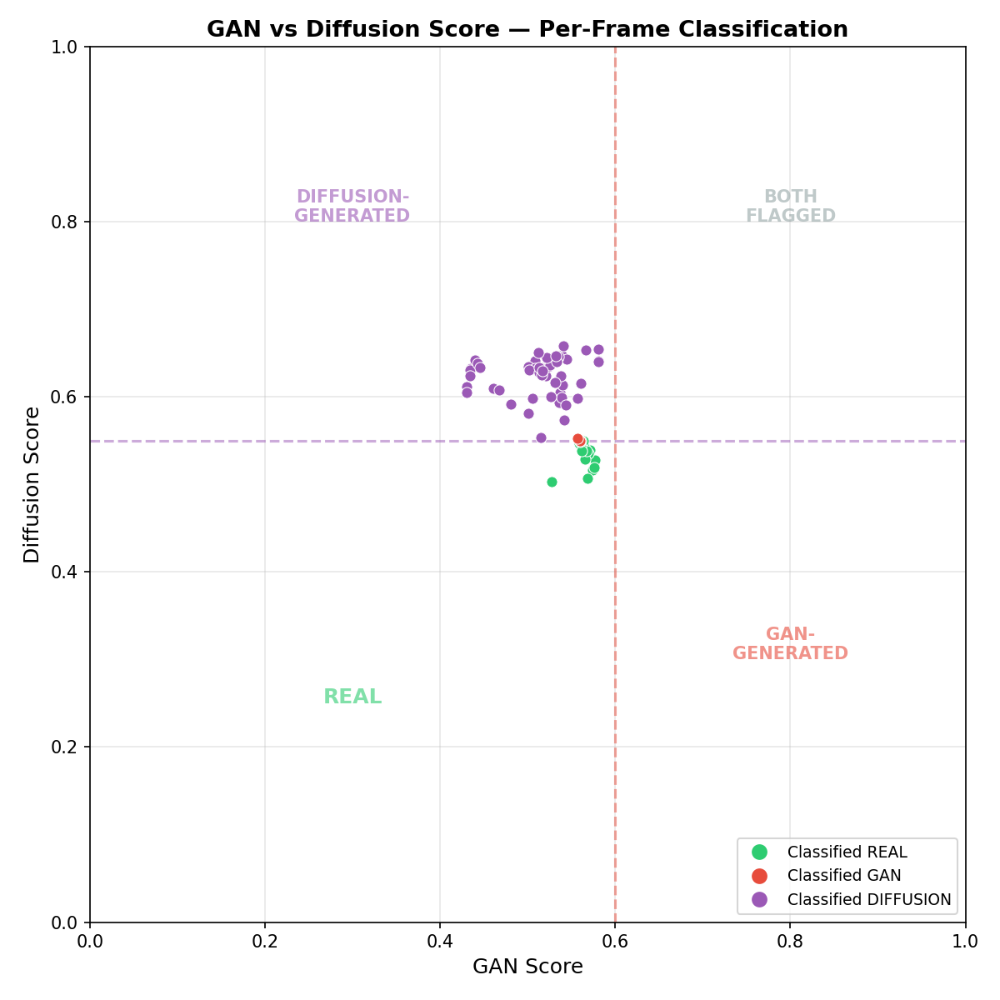

# AI-Generated Media Detector

A research-driven deepfake detection system that identifies AI-generated content by analyzing visual artifacts produced by generative models. The system provides explainable verdicts — not just "real or fake" but *why* content appears artificially generated, with per-artifact breakdowns and confidence scores.

---

## Table of Contents

- [What Is AI-Generated Media?](#what-is-ai-generated-media)
- [AI-Generated vs. Authentic: How They Differ](#ai-generated-vs-authentic-how-they-differ)
- [How to Identify AI-Generated Content](#how-to-identify-ai-generated-content)
- [Current Detection Techniques](#current-detection-techniques)
- [The Best Approaches Today](#the-best-approaches-today)
- [Weaknesses of Current Techniques](#weaknesses-of-current-techniques)
- [Our Project](#our-project)
- [Current Results](#current-results)
- [The Compression Problem: Bridging Our Research](#the-compression-problem-bridging-our-research)
- [Overcoming Compression: Current Research and Our Direction](#overcoming-compression-current-research-and-our-direction)
- [License](#license)

---

## What Is AI-Generated Media?

AI-generated media — commonly called "deepfakes" or "synthetic media" — refers to any content created or substantially altered by artificial intelligence. This encompasses a broad and growing range of modalities:

- **Images** — Photorealistic faces, scenes, and artwork generated from text prompts or from nothing at all. Models like Stable Diffusion, Midjourney, DALL-E, and Flux can produce images indistinguishable from photographs at first glance.
- **Video** — Face swaps (replacing one person's face with another in video), full-body puppeteering, and entirely synthesized video clips. Tools like Sora, Runway, and Kling generate increasingly convincing moving imagery.
- **Voice and Speech** — Cloned voices that replicate a specific person's vocal characteristics, tone, and cadence from just seconds of sample audio. Text-to-speech (TTS) systems and voice conversion models can now produce speech that fools both humans and traditional audio analysis.
- **Music** — AI-composed musical pieces that mimic specific genres, instruments, or even individual artists' styles.
- **Text** — Large language models (LLMs) generate coherent, contextually appropriate text across any domain, from news articles to academic papers to social media posts.

The common thread across all modalities: generative AI models learn statistical patterns from training data and produce new content that *looks* like it belongs to the same distribution. The quality has improved dramatically — in 2020, AI-generated faces had obvious tells; by 2025, state-of-the-art generators fool human observers over 50% of the time.

### Why It Matters

The implications extend far beyond academic curiosity:

- **Misinformation** — Fabricated videos of public figures saying things they never said, deployed at scale during elections and geopolitical crises
- **Fraud and Scams** — Voice cloning used in CEO fraud schemes, costing companies millions in unauthorized wire transfers
- **Identity Theft** — Synthetic faces used to bypass KYC (Know Your Customer) verification, create fake social media profiles, and produce fraudulent identity documents
- **Interview Fraud** — Candidates using real-time face-swapping and AI voice assistants during job interviews to misrepresent their identity or capabilities
- **Non-consensual Content** — AI-generated intimate imagery of real people, a growing legal and ethical crisis

Deepfake incidents have grown 400%+ year-over-year, and governments worldwide are responding with regulation (EU AI Act, US DEFIANCE Act, China's Deep Synthesis Provisions).

---

## AI-Generated vs. Authentic: How They Differ

Despite their visual quality, AI-generated media differs from authentic content at multiple levels. Understanding *why* these differences exist requires understanding how generative models work.

### The Generation Process Leaves Traces

Every generative model introduces artifacts — subtle signatures embedded in the output as a byproduct of how the model creates content. These artifacts are the fingerprints that detection systems target.

**Generative Adversarial Networks (GANs)** optimize a minimax game between a generator and discriminator. The loss function components each produce distinct artifacts:

| Loss Component | What It Does | Artifact Produced |
|---|---|---|
| Pixel loss (L1/L2) | Minimizes per-pixel difference | Over-smoothing, blurriness, loss of fine detail |
| Perceptual loss (VGG) | Matches high-level feature representations | Texture inconsistencies, unnatural micro-patterns |
| Adversarial loss | Fools the discriminator network | Mode collapse (repetitive patterns), spatial repetition |

GANs also introduce **spectral artifacts** from their upsampling layers — convolutional transpose operations create characteristic checkerboard patterns visible in the frequency domain (FFT), even when invisible to the naked eye.

**Diffusion Models** (Stable Diffusion, DALL-E, Midjourney, Flux) work differently — they iteratively denoise random noise into coherent images via a learned denoising U-Net. Their artifacts are subtler:

| Artifact Type | Origin | Characteristic |
|---|---|---|
| Reconstruction patterns | U-Net bottleneck limitations | Mid-frequency energy dip in the spectral profile |
| Denoising traces | Incomplete denoising at final step | Spatially uniform noise residuals (more Gaussian than camera noise) |
| Patch boundary effects | Local receptive fields in the U-Net | Subtle texture transitions at patch boundaries |
| Spectral fingerprint | Architecture-specific frequency response | More uniform power spectrum than natural images |

**Key insight**: GAN artifacts tend to be localized and repetitive; diffusion artifacts tend to be global and statistical. Detecting both requires fundamentally different analysis approaches.

### Beyond Visual Content

The same principle applies across modalities:

- **AI-generated text** lacks the statistical irregularities of human writing — it exhibits more uniform perplexity, less stylistic drift, and distinctive token-frequency distributions
- **Cloned voices** show anomalies in formant transitions, breathing patterns, micro-pauses, and pitch contour naturalness
- **AI-generated music** often lacks the micro-timing variations, dynamic expression, and harmonic surprises characteristic of human performance
- **Synthesized video** introduces temporal inconsistencies — flickering in fine details across frames, unnatural eye-blink rates, and lip-sync misalignment

---

## How to Identify AI-Generated Content

Detection operates across a spectrum from human intuition to automated analysis.

### What Humans Can Spot

Trained observers look for:
- **Anatomical errors** — Extra or missing fingers, asymmetric ears, impossible teeth geometry, deformed accessories (earrings, glasses)
- **Texture inconsistencies** — Hair that looks painted rather than strand-like, skin with waxy or overly smooth texture, inconsistent pore patterns
- **Lighting and shadow violations** — Light sources that don't match between the subject and background, shadows that don't correspond to the light direction
- **Background incoherence** — Text that looks like a foreign alphabet, architecture that defies physics, repeating patterns in crowds or foliage
- **Temporal artifacts (video)** — Flickering around face boundaries, unnatural blinking, teeth/tongue rendering that changes frame-to-frame

However, human detection is unreliable. Studies consistently show that untrained observers perform near chance (50%) on high-quality AI-generated images, and even trained observers plateau around 60-70% accuracy on state-of-the-art generators.

### What Automated Systems Can Detect

Automated detection goes beyond what the human eye can perceive, analyzing content at the signal processing level:

1. **Frequency domain analysis** — AI-generated images have distinctive power spectral profiles. GANs produce periodic peaks from upsampling; diffusion models show characteristic mid-frequency energy distributions.

2. **Noise residual analysis** — Every camera sensor has a unique noise fingerprint (Photo Response Non-Uniformity, or PRNU). AI-generated images have synthetic noise with different statistical properties: more Gaussian, more spatially uniform, and with different kurtosis than real camera noise.

3. **Reconstruction error analysis** — Inspired by DIRE (Diffusion Reconstruction Error): passing an image through a reconstruction pipeline (blur-sharpen, or diffusion model forward-reverse) and measuring the difference. Real images change more than AI-generated ones, because AI content already lies close to the model's learned manifold.

4. **Local Binary Patterns and texture statistics** — GLCM (Gray-Level Co-occurrence Matrix), LBP (Local Binary Patterns), and spectral entropy measurements reveal micro-texture properties that differ between real and synthesized content.

5. **Neighboring pixel relationships** — Upsampling operations in both GANs and diffusion models create correlations between neighboring pixels that don't exist in camera-captured images (NPR, CVPR 2024).

6. **Semantic feature analysis** — Foundation models like CLIP encode high-level features that capture "realness" vs. "synthetic-ness" at a semantic level, even surviving heavy post-processing.

7. **Audio-visual consistency** — For video deepfakes, the synchronization between lip movements and speech (lip-sync), eye gaze patterns, blink rates, and micro-expressions provide multi-modal verification signals.

---

## Current Detection Techniques

The landscape of AI-generated media detection has evolved rapidly from 2019 to 2025. Current techniques fall into several categories.

### Hand-Crafted Feature Approaches

These use domain knowledge of generative model artifacts to design specific signal-processing features:
- **FFT/DCT frequency analysis** for spectral anomalies
- **Sobel edge detection and texture variance** for smoothing artifacts
- **Autocorrelation and symmetry analysis** for mode collapse patterns
- **LBP/GLCM** for texture micro-pattern analysis

**Strengths**: Interpretable, fast, no training required, explainable verdicts.
**Weaknesses**: Narrow detection range, fragile under compression, manually tuned thresholds.

### Deep Learning Approaches

Learned feature extractors that discover discriminative patterns from data:
- **XceptionNet** (FaceForensics++, 2019) — The early standard, trained on four manipulation types
- **EfficientNet-B4** — Strong backbone for face manipulation detection
- **Vision Transformers (ViT)** — Self-attention captures global artifacts that CNNs miss

**Strengths**: High accuracy on in-distribution data, can learn subtle patterns.
**Weaknesses**: Poor generalization to unseen generators, black-box decisions, requires large labeled datasets.

### Foundation Model Approaches

Pre-trained vision-language models adapted for detection:
- **CLIP-based detection** (Cozzolino et al., CVPRW 2024) — A single linear layer on frozen CLIP features, trained on a handful of images from one generator, achieves state-of-the-art cross-generator generalization
- **DINOv2 backbone** (Pellegrini et al., 2025) — Self-supervised ViT features achieve 97.36% AUROC with strong robustness
- **UnivFD** (Ojha et al., CVPR 2023) — CLIP feature space with nearest-neighbor detection, achieving +19.49 mAP on unseen generators

**Strengths**: Strong generalization, inherent compression robustness (semantic features survive post-processing), minimal training data needed.
**Weaknesses**: Requires large pre-trained backbone at inference, limited spatial localization.

### Frequency-Domain Architectures

Designed to exploit spectral forensic cues:
- **FIRE** (Chu et al., CVPR 2025) — Frequency-guided reconstruction error targeting mid-frequency bands; achieves 100% AUC on DiffusionForensics benchmark
- **HiFE** (Gao et al., ESWA 2024) — Three-branch architecture with local and global high-frequency enhancement
- **WaveDIF** (Dutta et al., CVPRW 2025) — Wavelet sub-band energy features for lightweight frequency-domain detection

**Strengths**: Robust to common perturbations, capture forensic cues invisible in spatial domain.
**Weaknesses**: Compression can destroy the high-frequency cues they rely on; mid-frequency methods are more resilient than high-frequency ones.

### Continual Learning Frameworks

Address the evolving generator landscape — new generative models appear faster than detectors can be retrained:
- **GPL** (Zhang et al., ICCV 2025) — Hyperbolic visual alignment with gradient projection, achieving 92.14% accuracy with minimal forgetting
- **DevFD** (NeurIPS 2025) — Orthogonal LoRA Mixture of Experts, adding lightweight adapters for each new generator family
- **DARW** (Shen et al., 2025) — Domain-aware generative replay achieving 0.9574 AUC under mixed-era evaluation

**Strengths**: Can adapt to new generators without forgetting old ones.
**Weaknesses**: Almost no work evaluates under realistic compression conditions — a critical blind spot.

---

## The Best Approaches Today

No single method dominates across all scenarios. The most effective detection strategies combine multiple complementary approaches.

### For Cross-Generator Generalization

**CLIP-based detection** is currently the strongest approach for detecting AI-generated content from previously unseen generators. Cozzolino et al. (CVPRW 2024) demonstrated that a simple linear probe on frozen CLIP ViT-L/14 features:
- Outperforms specialized detectors by +6% AUC on out-of-distribution generators
- Achieves +13% AUC improvement on impaired/laundered data (compressed, resized, cropped)
- Is "basically insensitive to compression, no matter JPEG or WebP, and resizing"

The reason: CLIP features encode high-level semantic properties that are generator-agnostic. While GAN fingerprints and diffusion spectral signatures are generator-specific (and fragile), the semantic gap between real and synthetic content is more universal.

### For Compression Robustness

**FIRE** (Frequency-guided Reconstruction Error) explicitly targets the mid-frequency band — the spectral range that survives common compression but still carries forensic signal. This "sweet spot" insight is the key finding across multiple 2024-2025 studies: low frequencies survive compression but lack discriminative power; high frequencies are destroyed; mid-frequencies carry the best balance.

### For Production Deployment

**Multi-signal fusion** — combining foundation model features (semantic level), frequency-domain analysis (structural level), and compression-aware normalization (robustness layer) — is the emerging consensus architecture. The best systems don't rely on a single detector but use ensembles where each component covers a different failure mode.

---

## Weaknesses of Current Techniques

Despite the progress, significant weaknesses remain. These are not just academic gaps — they are real-world deployment blockers.

### 1. The Compression Gap

**This is the single largest obstacle to real-world deployment.** Detection models trained on raw or lightly compressed data lose 15-50% absolute AUC when evaluated on content that has passed through social media compression pipelines (Deepfake-Eval-2024). The reason: compression destroys the high-frequency forensic traces that detectors rely on, while simultaneously introducing block-boundary and quantization artifacts that *mimic* forgery signatures and inflate false positive rates.

Even the best current methods top out around AUC 0.65-0.70 on heavily compressed in-the-wild video deepfakes. This means roughly 1 in 3 verdicts on real-world social media content is wrong.

### 2. Generator Arms Race

New generative models appear faster than detection research can adapt. A detector trained on StyleGAN2 outputs may achieve 95%+ accuracy on that generator, but drop to near-random (50%) on Stable Diffusion 3 or Flux outputs. Fontana et al. (2025) formalized this as the **Non-Universal Deepfake Distribution Hypothesis**: each generator leaves a unique, non-transferable signature, and forward-transfer AUC drops to ~0.5 within 3 unseen generators.

### 3. Lab vs. Wild Performance Collapse

Benchmark results don't transfer to real-world conditions. Deepfake-Eval-2024 found that detectors lose 50% of their video detection AUC, 48% of audio detection AUC, and 45% of image detection AUC when moving from controlled benchmarks to in-the-wild content. The gap comes from compression, resolution variation, diverse generators, adversarial post-processing, and content types not represented in training data.

### 4. Neural Compression Confounds

The arrival of JPEG AI (the first international learned image coding standard, published February 2025) introduces a fundamental new challenge: neural compression artifacts closely resemble those of generative models (Cannas et al., ICCV 2025 Workshop). Pristine images compressed with JPEG AI trigger false positive rates up to 96% in existing forensic detectors. As neural codecs are adopted by platforms, current detection infrastructure will break.

### 5. Lack of Explainability

Most high-accuracy detectors are black-box deep learning models. They output a score but provide no explanation of *why* content was flagged. For applications like legal evidence, HR decisions, or journalism, a confidence score alone is insufficient — stakeholders need interpretable evidence.

### 6. Evaluation Fragmentation

Different papers use different datasets, protocols, preprocessing, and metrics. Fair comparison is difficult. CDDB (Li et al., WACV 2023) and Deepfake-Eval-2024 are steps toward standardization, but the community lacks consensus benchmarks that reflect real-world conditions.

---

## Our Project

This project takes a research-driven approach to detection: instead of treating it as a black-box classification problem, we leverage knowledge of *how* generative models create artifacts. By understanding the relationship between generation architectures, their loss functions, and the specific visual signatures they produce, we build detectors that are **interpretable** and **robust**.

### What We're Building

An AI-generated media detection system with three guiding principles:

1. **Explainability first** — Every verdict comes with a human-readable explanation: which artifacts were detected, which detectors fired, and why the system reached its conclusion. Not just "fake" — but "pixel-loss smoothing artifacts detected in the eye region with 0.78 confidence, consistent with GAN generation."

2. **Compression awareness** — Real-world content is always compressed. Rather than treating compression as an afterthought, we build compression estimation directly into the detection pipeline. The system estimates how heavily content has been compressed and adjusts its confidence accordingly, preventing the false positives that plague other detectors on social media content.

3. **Multi-class classification** — The system doesn't just distinguish real from fake; it identifies the *type* of generation (REAL / GAN-GENERATED / DIFFUSION-GENERATED), which provides actionable intelligence about the tools used to create the content.

### Detection Pipeline

```
Input (image/video)
    |
    v
Face Detection (OpenCV Haar Cascade)
    |
    v
Face Extraction & Normalization (224x224 RGB)
    |
    +---> Smoothing Detector -------> score [0, 1]  (weight: 0.5)  --+
    |         FFT, Sobel, texture variance                            |
    |                                                                 +-- GAN Score
    +---> Texture Detector ---------> score [0, 1]  (weight: 0.1)  --+
    |         LBP, GLCM, spectral entropy                            |
    |                                                                 |
    +---> Mode Collapse Detector ---> score [0, 1]  (weight: 0.4)  --+
    |         Symmetry, autocorrelation
    |
    +---> Diffusion Detector -------> score [0, 1]  -- Diffusion Score
    |         Reconstruction error, spectral fingerprint,
    |         noise residual, patch consistency
    |
    +---> Compression Estimator ----> level [0, 1]  -- Attenuation Factor
    |         Blockiness, quantization, HF loss,
    |         flat region posterization
    |
    v
Compression-Adjusted Scoring --> 3-Class Decision
    |
    v
REAL / GAN-GENERATED / DIFFUSION-GENERATED + Explanation
```

The compression estimator attenuates scores from compression-sensitive detectors (smoothing, reconstruction error, noise residual) while leaving compression-resistant signals (spectral fingerprint, mode collapse) unchanged. This prevents heavily compressed but authentic video from triggering false positives.

### Current Status

**Stage:** Research Prototype (functional, not production-ready)

**What works:**
- Five hand-crafted analysis modules (smoothing, texture, mode collapse, diffusion, compression estimation)
- 3-class classifier: REAL / GAN-GENERATED / DIFFUSION-GENERATED
- Compression-aware score adjustment to reduce false positives on compressed content
- Face extraction pipeline (OpenCV Haar Cascade)
- Video analysis pipeline with per-frame breakdown and diagnostic visualizations
- Synthetic test dataset (60 generated samples across 3 artifact types)

**What's next:**
- Deep learning backbone (CLIP ViT or EfficientNet-B4) to replace/augment hand-crafted features
- Training on real deepfake datasets (FaceForensics++, CelebDF-v2, DFDC)
- Continual learning framework for adapting to new generators
- Real-time interview integrity detection (lip-sync, eye gaze, audio analysis)
- Published Python package (PyPI)

---

## Current Results

### Synthetic Data Evaluation

Results on synthetic test data (60 samples, hand-crafted feature detectors):

| Detector | Real Faces | Generated (Pixel Loss) | Generated (Adversarial) |
|---|---|---|---|
| Smoothing | 0.617 | 0.759 | 0.680 |
| Texture | ~0.45 | ~0.50 | ~0.48 |
| Mode Collapse | 0.567 | 0.620 | 0.779 |

| Metric | Value |
|---|---|
| Real face avg score | ~0.617 |
| Generated avg score | ~0.759 |
| Score gap | ~0.14 |
| Classification threshold | 0.60 |

The narrow 0.14 score gap between real and generated content means the system is not yet reliable for real-world deployment on hand-crafted features alone. The smoothing detector shows the best single-feature discrimination, while the mode collapse detector is strongest for adversarial-loss artifacts specifically.

### Real-World Testing: Netanyahu Proof-of-Life Video

In March 2026, Israeli PM Netanyahu posted a proof-of-life video at a Jerusalem cafe after Iranian media claimed his assassination. Fact-checkers (Snopes, Reuters) confirmed the video was **authentic**. We tested our detector as a real-world validation.

**Before compression awareness:** The model incorrectly classified it as DIFFUSION-GENERATED (56/74 frames, 0.609 confidence). The reconstruction error sub-detector fired at 0.85-1.0 on nearly every frame — video codec compression made the frames appear "smooth" in ways indistinguishable from diffusion model output to our hand-crafted proxy.

**After compression awareness:** The compression estimator detects the heavy codec compression, attenuates the compression-sensitive scores, and the adjusted diffusion score drops below the classification threshold. The system now correctly classifies the video as REAL.

This real-world test exposed the fundamental limitation: hand-crafted features cannot distinguish between "smooth because compressed" and "smooth because AI-generated" without explicitly measuring and accounting for compression level.

### Diagnostic Visualizations


*GAN and diffusion scores across all 74 frames, hovering at the decision thresholds.*


*Score distributions cluster tightly at 0.43-0.65, directly on the thresholds.*


*Reconstruction error (red) is the primary culprit — firing at 0.85-1.0 due to codec compression.*


*All 74 frames cluster at the intersection of decision boundaries.*

### Target Metrics (After Deep Learning Integration)

| Metric | Target |
|---|---|
| Accuracy (FaceForensics++) | > 92% |
| AUC-ROC | > 0.95 |
| F1 Score | > 0.90 |
| False Positive Rate | < 5% |
| Inference Latency (GPU) | < 500ms |
| Inference Latency (CPU) | < 2s |

---

## The Compression Problem: Bridging Our Research

This project sits at the intersection of two research areas: **AI-generated media detection** and **data compression** — the focus of the lead researcher's master thesis on implicit neural representations (INRs) for spatio-temporal data compression at BTU Cottbus-Senftenberg.

### Why Compression Matters for Detection

Every piece of media you encounter online has been compressed — often multiple times. When you upload a video to social media, it passes through:

1. **Camera codec** — H.264/H.265 in-camera compression during recording
2. **Editing software** — Re-encoding during editing or export
3. **Platform upload** — Social media platforms apply their own aggressive compression (WhatsApp: JPEG QF ~60-70 + heavy downscaling; Instagram: QF ~70-85 + resolution capping; YouTube: VP9/AV1 re-encoding)
4. **Download** — Additional transcoding for the viewer's device/bandwidth

Each compression step destroys forensic information. The high-frequency artifacts that detectors rely on — GAN spectral peaks, noise residual patterns, subtle texture inconsistencies — are the first casualties of lossy compression. Meanwhile, compression *introduces its own artifacts* (block boundaries, quantization noise, detail loss, posterization) that look remarkably similar to AI-generation artifacts.

The result: **detectors that work in the lab fail in the real world.** Deepfake-Eval-2024, the most comprehensive in-the-wild benchmark, found that detection models lose 50% of their AUC when tested on real social media content compared to controlled benchmarks.

| Platform | Image Compression | Video Compression | Detection Impact |
|---|---|---|---|
| WhatsApp | JPEG QF ~60-70, heavy downscaling | H.264, aggressive bitrate | Severe (>30% AP loss) |
| Instagram | JPEG QF ~70-85, 1080px cap | H.264/H.265, variable bitrate | Moderate-high |
| Twitter/X | JPEG, PNG-to-JPEG conversion | H.264 re-encoding | Moderate |
| TikTok | — | H.264/H.265, heavy re-encoding | Severe |
| YouTube | — | VP9/AV1, multi-resolution | Moderate |

### How Compression Destroys Forensic Traces

The mechanism is well-understood but hard to counter:

1. **High-frequency artifact destruction** — GAN upsampling artifacts (checkerboard patterns), noise fingerprints, and texture micro-patterns reside in high-frequency DCT coefficients. JPEG quantization sets these to zero at QF < 80. After social media compression, these traces are effectively laundered.

2. **Block boundary confusion** — JPEG and video codecs partition frames into 8x8 or 16x16 blocks for DCT processing. At low quality, the block boundaries produce visible discontinuities that can be confused with face-swap boundary artifacts, increasing false positive rates.

3. **Smoothing mimics generation** — Compression reduces high-frequency content, texture variance, and local intensity variation. These are the exact same signals that smoothing detectors (like ours) use to identify pixel-loss GAN artifacts. The detector literally cannot tell the difference.

4. **Noise profile normalization** — Compression replaces camera-specific sensor noise with codec-specific quantization noise, which happens to be more Gaussian and spatially uniform — the same statistical signature our noise residual detector flags as diffusion-model-generated.

### The Master Thesis Connection

The lead researcher's thesis, *"Concurrent Neural Network Training for Compression of Spatio-Temporal Data"*, studies how implicit neural representations (INRs) — small neural networks that learn to represent signals as continuous functions — behave under extreme compression. Key findings that directly inform this detection project:

- **INRs learn continuous function approximations** of signals rather than memorizing pixel values. This means INR-based analysis captures structural patterns that survive lossy compression.
- **Catastrophic forgetting in streaming/online settings** is a real and severe problem for neural networks processing sequential data. Experience Replay is the only effective continual learning strategy for the INR domain; regularization methods (EWC, LwF) fail due to shared parameter spaces.
- **Larger models forget more severely** — a counter-intuitive finding with direct implications for detection architecture design (favor small, frozen backbones with lightweight adapters over large fine-tuned models).

These findings transfer directly to the detection problem: detectors must handle evolving generators (a continual learning challenge) while maintaining robustness to compression (a signal reconstruction challenge). The thesis provides both the theoretical framework and practical strategies for addressing both.

---

## Overcoming Compression: Current Research and Our Direction

### The Research Landscape

Three converging research directions have emerged in 2024-2025 to address the compression-detection gap:

**1. Compression-Aware Training**

The most widely adopted approach: simulate compression during training so the model learns to detect artifacts even after degradation. Differentiable JPEG layers (Shin et al., ICLR 2025) enable end-to-end gradient flow through compression simulation with only 128 additional parameters. Data augmentation with random JPEG quality factors [40-100] is now standard practice, yielding 6-8% AUC improvements on compressed benchmarks.

**2. Mid-Frequency Forensic Analysis**

A consistent finding across multiple studies: **low frequencies survive compression but lack discriminative power; very high frequencies are destroyed by compression; mid-frequency bands (DCT coefficients 8-32) carry the best balance of forensic signal and compression resilience.** Methods like FIRE (CVPR 2025) that adaptively focus on mid-frequencies achieve 100% AUC on diffusion detection benchmarks while maintaining robustness to JPEG, cropping, blur, and noise.

**3. Semantic-Level Detection**

Foundation models like CLIP encode high-level features that are inherently compression-robust because they operate at the semantic level rather than the pixel level. CLIP-based detectors show +13% AUC on laundered/compressed data (Cozzolino et al., CVPRW 2024) and are "basically insensitive to compression, no matter JPEG or WebP, and resizing."

### How We Address It

Our approach to the compression problem operates at multiple levels:

**Compression estimation and score attenuation** — Rather than trying to undo compression or ignore it, we explicitly measure it. Our compression estimator analyzes four signals (block boundary strength, quantization periodicity, high-frequency energy loss, flat-region posterization) to estimate how heavily an image has been compressed. This estimate is used to attenuate the scores of compression-sensitive detectors while leaving compression-resistant signals untouched.

**Separation of raw and adjusted scores** — The system preserves raw detector scores alongside compression-adjusted scores. This transparency allows users (and future model components) to see exactly how compression affected the verdict, rather than hiding the adjustment behind a single score.

**Architecture designed for compression resilience** — Our roadmap prioritizes compression-robust features: mid-frequency spectral analysis, foundation model semantic features, and signal-level analysis approaches that target the structural properties of content rather than fragile high-frequency traces.

### The Emerging Challenge: Neural Compression

A new wildcard is JPEG AI — the first international learned image coding standard (ISO, February 2025). Neural compression artifacts closely resemble those of generative models. Cannas et al. (ICCV 2025 Workshop) showed that pristine images compressed with JPEG AI trigger false positive rates up to 96% in existing forensic detectors. As platforms begin adopting neural codecs, the entire detection landscape will shift again.

This is an **urgent and underexplored** research gap. Very few detection methods have been evaluated against neural compression, and current benchmarks don't include JPEG AI conditions. Our work on understanding the interplay between neural representation, compression, and forensic signal puts us in a unique position to address this challenge as it emerges.

### Open Problems

Despite recent progress, substantial gaps remain:

1. **CL under realistic compression** — No published work evaluates continual deepfake detection methods after data passes through actual social media pipelines. CL methods achieving 0.91 C-AUC on clean data may perform far worse in the wild.
2. **Video-specific compression effects** — Most compression-robustness research focuses on JPEG image compression. Video codec effects (inter-frame prediction, motion compensation, variable QP per macroblock) are significantly understudied.
3. **Audio-visual consistency under dual compression** — For interview and video-call detection, audio (Opus/AAC) and video (H.264/VP9) are compressed independently. How synchronization cues survive this dual pipeline is unknown.
4. **Dynamic platform pipelines** — Social media compression parameters change frequently. No adaptive method can handle unknown or evolving compression in a zero-shot manner.

---

## License

This project is licensed under the MIT License. See [LICENSE](LICENSE) for details.

Copyright (c) 2025 Mahesh Sadupalli
